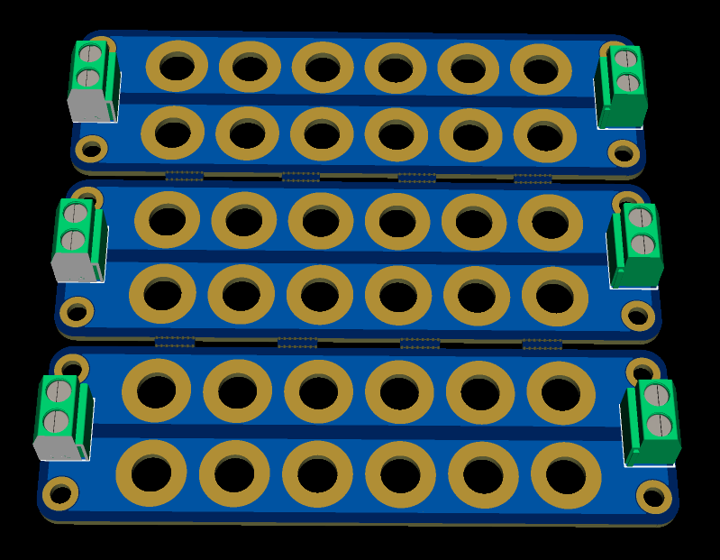
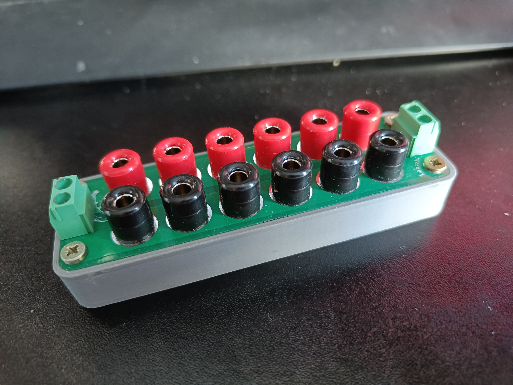

  

# BannanaHUB
A small powerdistribution board designed in easyEDA pro

## Rating
Sockets used are rated for 30Vac-60Vdc 10A so I wouldn't expect more from the whole board

## Design

  

  

## Contribution
- Whith open.bat you can generate the easyEDA pro project from the SQLs 
- Whith sace.bat you can generate the SQLs project from the easyEDA pro project

For further info about this whole easyEDA project conversion check out the [easyeda-git](https://github.com/neuroflag/easyeda-git) project.